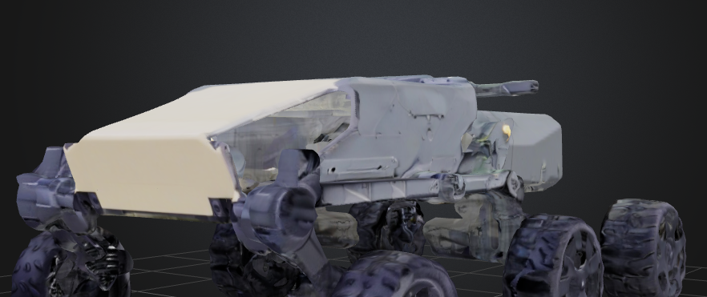

# Autonomous Agricultural Rover


## Objective
The Autonomous Agricultural Rover is designed to assist farmers by automating essential agricultural tasks such as soil analysis, crop monitoring, weed detection, and pesticide spraying. The rover is equipped with various sensors and actuators to efficiently perform these tasks, ultimately helping farmers make informed decisions and improve crop yields.

## Key Features

### 1. Navigation System
- **Autonomous Navigation:** The rover uses GPS or a combination of GPS and vision-based navigation (e.g., cameras, LiDAR) to autonomously traverse fields.
- **Obstacle Detection and Avoidance:** Ultrasonic sensors or IR sensors are implemented to detect and avoid obstacles, ensuring smooth operation in diverse terrains.

### 2. Soil Analysis
- **Soil Sensors:** The rover is equipped with sensors to measure soil moisture, temperature, and pH levels.
- **Data-Driven Decisions:** Collected data is used to help farmers make informed decisions regarding irrigation and fertilization.

### 3. Crop Monitoring
- **Plant Health Monitoring:** The rover uses multispectral cameras or normal cameras with image processing techniques (e.g., OpenCV) to monitor plant health.
- **Disease and Pest Detection:** Algorithms are implemented to detect diseases, pests, or nutrient deficiencies by analyzing leaf color and texture.

### 4. Weed Detection and Removal
- **Machine Learning Integration:** The rover uses machine learning models to detect and distinguish weeds from crops.
- **Targeted Weed Treatment:** A mechanical system or targeted pesticide sprayer is used to remove or treat weeds.

### 5. Autonomous Pesticide Spraying
- **Precise Application:** A sprayer system is attached to apply pesticides only where needed, reducing chemical usage.
- **Integrated Monitoring:** The crop monitoring system provides data for targeted and efficient pesticide spraying.

### 6. Data Logging and Reporting
- **Data Storage:** All sensor data is stored in a database.
- **User Interface:** A user-friendly interface is provided for farmers to access data.
- **Reports and Recommendations:** The system generates reports and recommendations based on the collected data.

### 7. Power System
- **Sustainable Power Supply:** The rover uses solar panels for a sustainable power supply, supplemented by rechargeable batteries.

## Technologies and Tools
- **Microcontroller/Processor:** Arduino and Raspberry Pi
- **Sensors:** Soil moisture sensor, pH sensor, temperature sensor, ultrasonic sensors, camera module, GPS module
- **Actuators:** Motor drivers, servo motors for steering, pesticide sprayer
- **Programming Languages:** Python, C/C++
- **Machine Learning:** TensorFlow for image processing and weed detection


### Available Models:


- **Rover Chassis:** `Rover_model1.fbx`
## Getting Started

### Prerequisites
- Arduino IDE or Python development environment
- Required hardware components (sensors, actuators, microcontroller, etc.)

### Installation
1. Clone the repository:
   ```bash
   git clone https://github.com/yourusername/autonomous-agricultural-rover.git
   ```
2. Set up the Arduino or Raspberry Pi with the necessary libraries and upload the code.

3. Connect the sensors and actuators according to the provided schematics.

4. Run the main program to start the rover's operations.

### Usage
- The rover can be controlled via the provided user interface.
- Access real-time data and reports through the dashboard.

